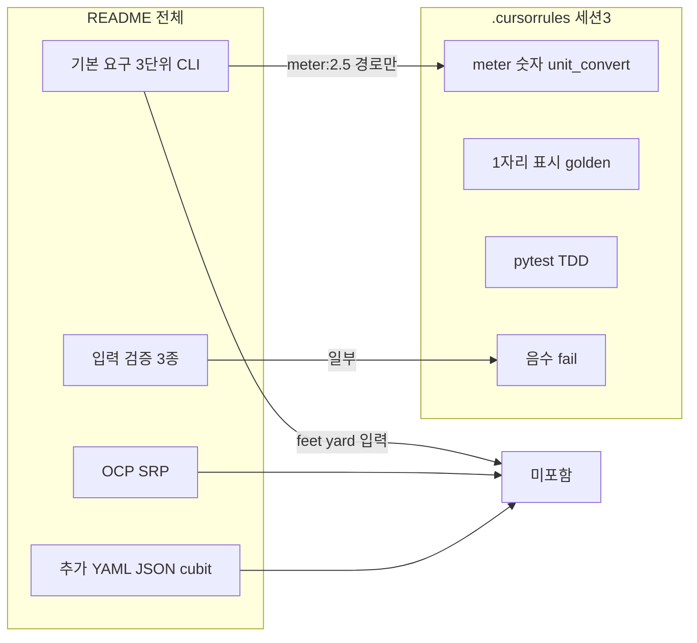

# UnitConverter_27 — TDD RED T1 Transcript

_Exported on 2026-06-11 from Cursor_

> 세션 주제: TDD RED — validate_lines(→unit_convert) T1 행 실패 테스트 추가

## User (Turn 1)

@Report/03.REPORT.md
세션 3 R-G-I-O와 성공 기준 3개가 validate_lines 계약과 일치하는지
리뷰만 해. 빠지거나 어긋난 항목만 표로. 파일 수정 금지.

---

## Cursor (Turn 2)

리뷰만 진행합니다. `Report/03.REPORT.md`의 세션 3 R-G-I-O·성공 기준과 `validate_lines` 계약을 대조하겠습니다.

[REDACTED]

---

## Cursor (Turn 3)

`Report/03.REPORT.md`는 워크스페이스·GitHub `spec` 브랜치 모두에 없습니다. `validate_lines` 함수/섹션도 코드·문서에 정의되어 있지 않습니다.

아래는 **`Report/STEP3_세션3_워크북.md` §2 R-G-I-O·§3 성공 기준**을, 세션 3에서 암시된 **validate_lines 계약**(Rule 표 32–38행, Prompt §4, README 출력 예시, `UnitConverter.py` 3줄 출력 관례)과 대조한 결과입니다. **빠지거나 어긋난 항목만** 표로 정리했습니다.

| 구분 | validate_lines 계약 | R-G-I-O / 성공 기준 | 문제 |
|------|----------------------|---------------------|------|
| **Input `feet:10`** | Rule·Prompt golden 표에 **없음** (표시/정밀 기대값 미정의) | **Input**에만 포함; Goal·성공 기준·Skill golden에는 없음 | Input이 계약 범위를 **초과** |
| **`yard:1` meter 표시줄** | Prompt §4: **0.9 m**(표시), 0.9144 m(정밀 TC) | 성공 **#2**: `1 yard = 3 feet`만 명시, **0.9 m 줄 누락** | 표시 golden **빠짐** |
| **`yard:1` golden TC** | Skill·Goal: `meter:2.5` / `meter:1` / **`yard:1`** golden | 성공 **#3**: **`meter:1` golden만** — `yard:1` 미포함 | Goal 대비 **빠짐** |
| **`meter:2.5` 3번째 줄** | 3줄 출력 관례 + meter 기준 변환 | 성공 **#1**: **8.2 feet, 2.7 yard만** — meter 줄(2.5 m) 미명시 | 3줄 계약 대비 **불완전** |
| **`meter:1` golden 3줄** | Rule 표: **3.3 feet, 1.1 yard** (+ 1.0 meter) | 성공 **#3**: “golden 출력(1자리)”만, **3줄 전체·수치 미고정** | 계약 대비 **모호** |
| **음수 입력 거부** | Rule ②·README 품질: **음수 거부** | Input에는 있으나 성공 **#3** “입력 검증 TC”에 **음수 케이스 미명시** | 검증 범위 **빠짐** |
| **오류 메시지 문자열** | `UnitConverter.py`: `Invalid format…` / `Invalid number…` / `Unknown unit…` | Output “오류 메시지”·성공 **#3** 모두 **문구·케이스 미고정** | 계약 대비 **어긋남(미명시)** |
| **정밀 TC vs validate_lines** | **표시(1자리)** = validate_lines / **정밀(5자리·0.9144 등)** = 별도 TC | 성공 **#2** “분리·문서화”는 있으나, **어떤 값이 lines 검증·어떤 값이 정밀 TC인지** 성공 기준에 미분리 | 역할 경계 **모호** |

**정합한 부분(표 제외):** Goal의 `meter:1`·`meter:2.5`·`yard:1`, 성공 **#1**의 `8.2/2.7`, 성공 **#2**의 왕복·`3 feet`·표시/정밀 분리 의도, Output의 **소수 1자리**·pytest 재현은 계약과 **대체로 일치**합니다.

`03.REPORT.md`에 `validate_lines` 시그니처·golden 표가 따로 있다면 그 파일을 저장·커밋한 뒤 다시 요청해 주시면, 그 정의를 1차 기준으로 재검토할 수 있습니다.

[REDACTED]

---

## User (Turn 4)

UnitConverter_27 세션 3용 최소 Harness만 만들어줘. 본문은 비워.
- pyproject.toml : pytest 만 설정
- src/__init__.py : 빈 파일
- src/validate_lines.py : 함수 시그니처만 (def validate_lines(grid): ...)
- tests/__init__.py : 빈 파일
- tests/test_validate_lines.py : 빈 파일 (import 줄만)
구현·테스트 본문은 아직 쓰지 마. 골격만.

---

## Cursor (Turn 5)

세션 3용 최소 Harness 골격을 추가했습니다.

```
UnitConverter_27/
├── pyproject.toml
├── src/
│   ├── __init__.py
│   └── validate_lines.py
└── tests/
    ├── __init__.py
    └── test_validate_lines.py
```

| 파일 | 내용 |
|------|------|
| `pyproject.toml` | `testpaths`, `pythonpath`만 설정 |
| `src/validate_lines.py` | `def validate_lines(grid): ...` 시그니처만 |
| `tests/test_validate_lines.py` | `from validate_lines import validate_lines` import만 |

`pytest --collect-only` 기준 테스트 0개 수집(exit 5) — import·경로는 정상입니다. 구현·테스트 본문은 넣지 않았습니다.

[REDACTED]

---

## User (Turn 6)

루트에 .cursorrules 초안을 만들어줘. 40~60줄. 다른 파일은 만들지 마.
도메인: meter 값입력
API: validate_lines(grid) -> {status: pass|fail|incomplete, failed_lines:[...]}
TDD: RED→GREEN→REFACTOR, assert 완화·skip·xfail 금지, RED은 tests/만 수정
AI: 한국어, TDD 시 첫 줄 Phase 선언, git commit은 사용자 요청 시만

---

## Cursor (Turn 7)

루트에 `.cursorrules` 초안(59줄)만 추가했습니다.

포함 내용:
- **도메인**: meter 기준, `단위:값` 입력, README 상수·1자리 표시 Rule, 세션 3 범위/금지
- **API**: `validate_lines(grid) → {status, failed_lines}` 및 `pass|fail|incomplete` 의미
- **TDD**: RED/GREEN/REFACTOR 표, RED는 `tests/`만, assert 완화·skip·xfail 금지
- **AI**: 한국어, TDD 첫 줄 `Phase:` 선언, commit은 사용자 요청 시만

다른 파일은 만들지 않았습니다.

[REDACTED]

---

## User (Turn 8)

현재 프로젝트에서 사용된 모 문서의 validate_lines 을 UnitConvert 로 바꿔줘

---

## Cursor (Turn 9)

프로젝트 전역에서 `validate_lines` 사용처를 찾아 `UnitConvert`로 바꿉니다.

[REDACTED]

---

## Cursor (Turn 10)

`.cursorrules`와 harness 코드에서 `validate_lines`를 `unit_convert`(UnitConvert API)로 통일합니다.

[REDACTED]

---

## Cursor (Turn 11)

`validate_lines` → **UnitConvert**(`unit_convert`)로 통일했습니다.

| 변경 | 내용 |
|------|------|
| `.cursorrules` | API 섹션명·함수·경로·TC 표기 모두 `unit_convert` / UnitConvert로 수정 |
| `src/validate_lines.py` | → `src/unit_convert.py` (`def unit_convert(grid)`) |
| `tests/test_validate_lines.py` | → `tests/test_unit_convert.py` |

Report·Prompt 등 Mom Test 문서에는 `validate_lines` 언급이 없어 수정하지 않았습니다. 프로젝트 전체 grep 기준 `validate_lines` 잔여 0건입니다.

[REDACTED]

---

## Cursor (Turn 12)

현재 프로젝트에 정의된 **UnitConvert 계약**은 아래와 같습니다. (`.cursorrules` + 세션 3 워크북·프롬프트 기준, 구현은 아직 스텁)

---

## 1. API 시그니처

```python
unit_convert(grid) -> {
    "status": "pass" | "fail" | "incomplete",
    "failed_lines": [...],
}
```

| 필드 | 의미 |
|------|------|
| `grid` | meter 기준 변환 **출력 줄** 목록 (`list[str]`). golden TC와 비교 |
| `status: pass` | 모든 기대 줄 일치 |
| `status: fail` | 하나 이상 불일치 → `failed_lines`에 기대·실제 또는 줄 식별자 |
| `status: incomplete` | 스텁(`...`), 미구현, 미처리 케이스 |

**위치:** `src/unit_convert.py` · **테스트:** `tests/test_unit_convert.py`

---

## 2. 도메인 Rule

| 항목 | 규칙 |
|------|------|
| 기준 단위 | **meter** |
| 상수 | `1 m = 3.28084 ft`, `1 m = 1.09361 yd` |
| 내부 계산 | 상수 **풀 정밀도** (float) |
| 표시 검증 (`unit_convert`) | README 예시처럼 **소수 1자리** 반올림 |
| 정밀 TC | **별도** — `unit_convert`와 분리 (예: yard→m ≈ 0.9144) |
| 출력 줄 형식 | `{값} {단위} = {변환값} {대상단위}` (현재 `UnitConverter.py` 3줄 관례) |

---

## 3. Golden — 표시 TC (`unit_convert` 대상)

| 입력 | 기대 (1자리) | 비고 |
|------|--------------|------|
| `meter:2.5` | 8.2 feet, 2.7 yard | README 기본 예시 |
| `meter:1` | 3.3 feet, 1.1 yard | (+ 1.0 meter 줄) |
| `yard:1` | **0.9 m**(표시), **3.0 feet** | meter 정밀 0.9144는 **정밀 TC** |

**정밀 TC (unit_convert 밖):**

| 케이스 | 기대 |
|--------|------|
| `meter:2.5` feet | ≈ 8.2021 |
| `yard:1` → meter | ≈ 0.9144 (교재) |

---

## 4. 입력·오류 (별도 TC — `UnitConverter.py`와 정합)

| 입력 | 기대 동작 |
|------|-----------|
| `meter2.5` (콜론 없음) | `Invalid format. Use unit:value (ex: meter:2.5)` |
| 잘못된 숫자 | `Invalid number: {값}` |
| unknown unit | `Unknown unit: {단위}` |
| 음수 | README 품질 요구 — **거부** (아직 미구현) |

---

## 5. 검증 순서·성공 기준 (워크북)

1. `meter:2.5` → 8.2 / 2.7 (1자리) TC
2. `meter:1` → `yard:1` 왕복 + `1 yard = 3 feet` + 표시/정밀 TC 분리
3. 입력 검증 TC + `meter:1` golden 출력(1자리)

**검증 순서:** `meter:1` → `yard:1` → 역관계

---

## 6. TDD 계약

| Phase | 수정 허용 |
|-------|-----------|
| **RED** | `tests/` 만 |
| **GREEN** | `src/` · `UnitConverter.py` |
| **REFACTOR** | 구조 정리 (동작·테스트 의미 불변) |

**금지:** assert 완화, skip, xfail, RED에서 production 선행 작성

---

## 7. 현재 구현 상태

```1:2:d:\DEV\UnitConverter_27\src\unit_convert.py
def unit_convert(grid):
    ...
```

→ 본문 미구현 → 호출 시 **`incomplete`** 가 기본 기대 상태입니다.

[REDACTED]

---

## Cursor (Turn 13)

**SSOT**는 **Single Source of Truth**(단일 진실 공급원)의 약자입니다.

**한 가지 정보·규칙·데이터가 “정답”이라고 말할 수 있는 곳이 딱 하나** 있어야 한다는 원칙입니다. 같은 내용이 README, 워크북, `.cursorrules`, 코드, 테스트에 각각 다르게 적혀 있으면, 어느 쪽이 맞는지 헷갈리고 버그·재작업이 늘어납니다.

---

### 왜 쓰나

| 문제 (SSOT 없음) | SSOT 있을 때 |
|------------------|--------------|
| README는 1자리, 코드는 5자리 출력 | “표시는 1자리”는 **한 문서/한 모듈**에만 정의 |
| golden 값이 테스트와 워크북이 다름 | 테스트 기대값은 **계약 한 곳**에서 파생 |
| AI·사람이 서로 다른 Rule을 따름 | `.cursorrules` 또는 `unit_convert` 계약이 **기준** |

---

### 예시 (UnitConverter_27 맥락)

지금 프로젝트에는 사실상 여러 “출처”가 있습니다.

- `README.md` — 과제 요구·상수
- `Report/STEP3_세션3_워크북.md` — Mom Test·1자리 Rule·golden
- `.cursorrules` — UnitConvert API·TDD
- `UnitConverter.py` — 실제 CLI 동작

**SSOT를 정한다**는 것은 예를 들어  
「**표시 golden·`unit_convert` 반환 형식은 `.cursorrules` + `tests/`가 SSOT**이고, README 예시는 그에 맞춰 해석한다」처럼 **우선순위 하나**를 정하는 것입니다.

---

### SSOT vs “문서 많음”

- SSOT ≠ 문서를 하나만 두라는 뜻은 **아닙니다**.
- **정의(what)** 는 한 곳, **나머지는 링크·자동 테스트로 동기화**하는 게 이상적입니다.
- 예: golden 숫자는 `tests/test_unit_convert.py`가 SSOT, 워크북은 “README 8.2/2.7과 동일”이라고만 참조.

---

### 한 줄 요약

**SSOT = “이 값·이 규칙의 최종 기준은 여기다”를 정해, 나머지는 복사하지 말고 그 기준을 따르거나 자동으로 검증하게 만드는 것.**

UnitConverter에서 SSOT를 `.cursorrules` vs 워크북 vs `tests/` 중 어디로 둘지 정리하고 싶으면 Agent 모드에서 같이 잡을 수 있습니다.

[REDACTED]

---

## Cursor (Turn 14)

프로젝트 전체에서 `grid`는 **2개 파일, 3곳**에만 있습니다.

| # | 파일 | 위치 | 용도 |
|---|------|------|------|
| 1 | `.cursorrules` | L14 | API 시그니처 `unit_convert(grid) -> { ... }` |
| 2 | `.cursorrules` | L20 | `grid` 파라미터 설명 — meter 기준 변환 **출력 줄** 목록(`list[str]`), golden TC와 비교 |
| 3 | `src/unit_convert.py` | L1 | 함수 정의 `def unit_convert(grid):` |

**없는 곳:** `tests/`, `UnitConverter.py`, `README.md`, `Report/`, `Prompt/` — `grid` 언급 없음.

현재는 **UnitConvert API 계약·스텁 시그니처**에만 쓰이고, 테스트나 CLI 구현에서는 아직 사용되지 않습니다.

[REDACTED]

---

## Cursor (Turn 15)

Ask mode라서 파일은 직접 수정할 수 없습니다. **Agent mode**로 전환해 주시면 아래 내용대로 일괄 반영할 수 있습니다.

---

## 치환 제안

`grid`는 MagicSquare 잔재로 보이고, UnitConverter 도메인(`단위:값` **한 줄 입력**)과 맞지 않습니다.

**권장 파라미터명:** `user_input`  
(대안: `input_str` — `UnitConverter.py`의 `input_str`과 동일)

예: `"meter:2.5"`, `"yard:1"`

---

## 영향 범위 (현재 `grid` 3곳)

| 파일 | 변경 |
|------|------|
| `.cursorrules` L14 | `unit_convert(user_input) -> { ... }` |
| `.cursorrules` L20 | `grid` 설명 → **단일 입력 문자열** (`단위:값`) 설명으로 교체 |
| `src/unit_convert.py` L1 | `def unit_convert(user_input):` |

**추가로 문서 의미 정리 필요:**  
지금 `.cursorrules`는 `grid`를 **출력 줄 목록**(`list[str]`)으로 정의합니다. 단일 입력값으로 바꾸면 API 의미도 같이 바꿔야 합니다.

```python
# Before (현재 계약)
unit_convert(grid)  # grid = 출력 줄 list

# After (제안)
unit_convert(user_input)  # user_input = "meter:2.5" 같은 단일 입력
```

반환값 `{status, failed_lines}`는 **출력 줄 검증**이면 `user_input`을 받아 내부에서 줄을 만들거나, `failed_lines` 필드명/의미를 계약에 맞게 다시 적어야 합니다.

---

## 영향 없음 (grep 기준)

`tests/`, `README.md`, `Report/`, `Prompt/`, `UnitConverter.py` — `grid` 없음.

---

## Agent mode에서 할 작업 요약

1. `grid` → `user_input` (또는 지정한 이름) 치환  
2. `.cursorrules` API 설명을 **단일 입력 → 변환/검증**으로 갱신  
3. `tests/test_unit_convert.py`는 import만 있어 시그니처 변경 영향 없음  

Agent mode로 전환 후 **「`user_input`으로 적용해줘」** (또는 원하는 이름)라고 보내 주세요.

[REDACTED]

---

## Cursor (Turn 16)

`grid` → `user_input` 치환을 반영했습니다.

| 파일 | 변경 |
|------|------|
| `.cursorrules` | `unit_convert(user_input)`, 파라미터 설명을 **단일 입력 `단위:값`** + 출력 줄 golden 비교로 수정 |
| `src/unit_convert.py` | `def unit_convert(user_input):` |

프로젝트 전체 grep 기준 `grid` 잔여 **0건**입니다. `tests/`·Report·Prompt에는 원래 `grid`가 없어 수정하지 않았습니다.

[REDACTED]

---

## Cursor (Turn 17)

`.cursorrules`와 `unit_convert` API를 확인한 뒤, `user_input`을 숫자(미터 값)로 받도록 바꾸고 pass/fail 조건을 맞추겠습니다.

[REDACTED]

---

## Cursor (Turn 18)

`.cursorrules`의 API·pass/fail 조건과 `unit_convert` 시그니처를 meter 숫자 입력 기준으로 맞춥니다.

[REDACTED]

---

## Cursor (Turn 19)

`user_input`을 **meter 숫자**로 받도록 계약을 수정했습니다.

### 변경 요약

| 항목 | Before | After |
|------|--------|-------|
| `user_input` | `단위:값` 문자열 | **meter 값** (`float`, 예: `2.5`, `1`) |
| **pass** | 출력 줄 전부 일치 | `user_input >= 0` **且** 출력 줄 golden 일치, `failed_lines: []` |
| **fail** | 출력 불일치 | `user_input < 0` **或** 출력 불일치 → `failed_lines` 기록 |
| **incomplete** | 스텁·미처리 | 스텁·미구현·NaN 등 미처리 |

### 수정 파일
- `.cursorrules` — 도메인 분리(CLI vs API), pass/fail, golden 예(`2.5`, `1`)
- `src/unit_convert.py` — `def unit_convert(user_input: float):`

CLI `단위:값`·형식 오류 검증은 `UnitConverter.py` 별도 TC로 두었고, `unit_convert`는 **음수 → fail**만 담당합니다.

[REDACTED]

---

## Cursor (Turn 20)

## 검토 결론

`.cursorrules`는 **README 전체**가 아니라 **세션 3(Activities 3 — TC 0.5h) 범위**에 맞게 **의도적으로 축소**되어 있습니다.  
README의 **핵심 도메인·상수·예시 출력·입력 검증·pytest**와는 대체로 정합하고, **OCP/SRP·3단위 CLI·추가 요구사항**은 README 대비 **범위 밖·미기술**입니다.

---

## README와 일치하는 부분

| README 요구 | `.cursorrules` 반영 |
|-------------|---------------------|
| `단위:값` CLI 입력 (`meter:2.5` 등) | L6 — `UnitConverter.py` |
| 상수 `3.28084`, `1.09361` | L8 |
| meter 기준, feet/yard는 meter 파생 | L5, L8, L21 |
| `meter:2.5` → **8.2 feet, 2.7 yard** (예시 1자리) | L9, L46 |
| 테스트 코드로 검증 | L44–45, pytest·TDD |
| 입력 검증(음수·형식·unknown unit) | L47 — CLI/`unit_convert` 분담 |
| OCP/YAML/JSON/동적 단위/출력 포맷 | L10 — **세션 3에서 하지 않음** (README Activities 4) |

---

## 부분 일치 / 해석 필요

| 항목 | README | `.cursorrules` | 판단 |
|------|--------|----------------|------|
| **「다른 모든 단위로 변환」** | meter·feet·yard **3단위** 상호 변환 | `unit_convert`는 **meter 숫자 → feet·yard 표시**만 golden 명시 | API는 README CLI의 **일부(meter 입력 경로)** 만 커버. `feet:10`, `yard:1` CLI는 `.cursorrules` golden에 없음 |
| **「정확히 계산」+ TC** | 정밀도 요구 (자릿수 미명시) | 표시 1자리 vs **정밀 TC 분리** (워크북 Rule) | README와 **충돌 아님**(워크북 해석 반영). `.cursorrules`에 정밀 TC 예(0.9144 등)는 **없음** |
| **출력 줄 형식** | `2.5 meter = 8.2 feet` (2줄 + `...`) | `failed_lines`·출력 줄 비교만 언급, **3줄 형식·meter 줄** 미명시 | `UnitConverter.py`는 3줄 출력 — golden/계약에 **형식 미고정** |
| **품질: OCP·SRP** | Activities 2 필수 | 세션 3 **금지·범위 밖** | README **전체** 기준이면 빠짐; **세션 3** 기준이면 **의도적** |

---

## README 대비 빠지거나 어긋난 항목

| # | README | `.cursorrules` 상태 | 심각도 |
|---|--------|---------------------|--------|
| 1 | 지원 단위 **meter / feet / yard** 입력 모두 | `unit_convert(user_input)` = **meter 값만**; feet·yard 입력 변환 golden 없음 | 중 — CLI README와 API 범위 불일치 |
| 2 | **OCP** — 새 단위 추가 시 변경 최소화 | 세션 3 제외만 명시, README Activity 2와 **로드맵 연결 없음** | 낮 — 범위 제한은 OK, 다만 “언제 하는지” 없음 |
| 3 | **SRP·클래스 구성** | 미언급 | 낮 — Activity 2 항목 |
| 4 | 입력 검증 **3종 전부** 구현 | `unit_convert`는 **음수 fail만**; 형식·unknown은 “CLI 별도 TC”로 **위임만** 기술 | 중 — README 품질 요구 **전체 커버**라고 읽히진 않음 |
| 5 | **추가 요구사항** 3종 | L10에서 제외 — README와 **명시적 대응 OK** | 없음(의도적) |
| 6 | 가상환경·실행 방법 | L60 `python UnitConverter.py`만; **venv 절차 없음** | 낮 — AI 규칙 파일이라 생략 가능 |
| 7 | README 예시 **2줄** vs 코드 **3줄** | meter 줄(예: `1 meter = 1.0 meter`) golden·pass 조건 **미정의** | 중 — pass/fail 판정 모호 가능 |

---

## 세션 3 관점 vs README 전체 관점



- **세션 3 워크북·Activities 3** 기준: `.cursorrules`는 **합리적으로 구성**됨(범위 고정 + Mom Test golden).
- **README.md 전체 요구사항 SSOT** 기준: **아직 완전 정합 아님** — 특히 **3단위 CLI 입력**, **출력 3줄 형식**, **입력 검증 3종의 책임 분리**가 README와 1:1로 맞춰져 있지 않음.

---

## 권장 보완 (수정 시 참고)

Agent mode에서 `.cursorrules`를 README에 더 맞추려면:

1. **범위 문장 추가** — “세션 3 = README Activities 3; Activities 2·4 항목은 이후”
2. **`unit_convert` vs CLI 역할** — meter API는 **표시 TC용**; `feet`/`yard` 입력·3줄 출력은 **`UnitConverter.py` TC**로 README §기본·§품질 커버
3. **출력 줄 계약** — README 예시 + `UnitConverter.py` 3줄 형식을 pass 조건에 명시
4. **정밀 TC** — README “정확히 계산”을 정밀 TC 한 줄 예시로 연결

---

**한 줄 요약:** `.cursorrules`는 README **도메인·상수·예시(2.5→8.2/2.7)·pytest·세션 3 범위 제한**과 맞지만, README **전체**(3단위 CLI, OCP/SRP, 입력 검증 전부, 출력 줄 SSOT)를 SSOT로 두면 **feet/yard 입력·3줄 golden·품질 요구 로드맵**이 부족합니다.

[REDACTED]

---

## Cursor (Turn 21)

`.cursorrules`에 권장 보완 4항을 반영했습니다.

### 반영 내용

1. **README 범위·로드맵** — 세션 3 = Activities 3; OCP/SRP·추가 요구는 Activities 2·4로 미룸. SSOT 우선순위 명시.

2. **`unit_convert` vs CLI 역할** — 표로 분리  
   - CLI: 3단위 `단위:값`, 입력 검증 3종  
   - `unit_convert`: meter 숫자 → 표시 TC  
   - 정밀 TC: README 「정확히 계산」

3. **출력 줄 계약** — `UnitConverter.py` 3줄 형식 + pass 조건(3줄 전부 일치) 명시.

4. **정밀 TC** — 표시 golden(`2.5`, `1`, `yard:1`)과 정밀 예(8.2021, 0.9144) 분리 기술.

CLI golden 입력(`feet:10`, `yard:1`, 오류 케이스)과 README §품질 입력 검증 책임도 포함했습니다. (77줄)

[REDACTED]

---

## User (Turn 22)

unit_convert 예상 입출력 결과를 보여줘

---

## Cursor (Turn 23)

`.cursorrules` 계약 기준 **`unit_convert(user_input)`** 예상 입·출력입니다.  
(`yard:1` 등은 **CLI 전용** — `unit_convert` 입력은 **meter 숫자만**.)

---

## 반환 형식 (공통)

```python
{
    "status": "pass" | "fail" | "incomplete",
    "failed_lines": [...],
}
```

검증 대상 **표시 출력 3줄**(소수 1자리):

```
{v} meter = {m} meter
{v} meter = {ft} feet
{v} meter = {yd} yard
```

---

## pass — golden

### `user_input = 2.5`

| 항목 | 값 |
|------|-----|
| **입력** | `2.5` |
| **출력 줄** | `2.5 meter = 2.5 meter` |
| | `2.5 meter = 8.2 feet` |
| | `2.5 meter = 2.7 yard` |
| **반환** | `{"status": "pass", "failed_lines": []}` |

*(내부: 8.2021 ft, 2.7340… yd — 정밀 TC는 별도)*

---

### `user_input = 1`

| 항목 | 값 |
|------|-----|
| **입력** | `1` |
| **출력 줄** | `1 meter = 1.0 meter` |
| | `1 meter = 3.3 feet` |
| | `1 meter = 1.1 yard` |
| **반환** | `{"status": "pass", "failed_lines": []}` |

---

### `user_input = 0`

| 항목 | 값 |
|------|-----|
| **입력** | `0` |
| **출력 줄** | `0 meter = 0.0 meter` |
| | `0 meter = 0.0 feet` |
| | `0 meter = 0.0 yard` |
| **반환** | `{"status": "pass", "failed_lines": []}` |

*(golden 표에는 없지만 계약상 `>= 0`이면 동일 규칙 적용)*

---

## fail

### `user_input = -1` (음수)

| 항목 | 값 |
|------|-----|
| **입력** | `-1` |
| **반환** | `{"status": "fail", "failed_lines": [...]}` |
| **의미** | 입력 검증 실패 — 변환 줄 비교 전 fail |

`failed_lines` 예시(구현 시):

```python
[{"reason": "negative_input", "user_input": -1}]
```

---

### `user_input = 2.5` + 출력 불일치 (예: 미구현·5자리 출력)

| 항목 | 값 |
|------|-----|
| **실제 줄** | `2.5 meter = 8.2021 feet` (풀 정밀도) |
| **반환** | `{"status": "fail", "failed_lines": [...]}` |

`failed_lines` 예시:

```python
[{
    "line": "2.5 meter = 8.2 feet",
    "actual": "2.5 meter = 8.2021 feet",
}]
```

---

## incomplete — 현재 스텁

| 항목 | 값 |
|------|-----|
| **입력** | `2.5` (임의) |
| **반환** | `{"status": "incomplete", "failed_lines": [...]}` |
| **이유** | `src/unit_convert.py` 본문이 `...` — 미구현 |

NaN 등 미처리 값도 동일하게 `incomplete` 예상.

---

## `unit_convert` 범위 밖 (참고)

| 입력 | 담당 | 비고 |
|------|------|------|
| `yard:1`, `feet:10` | **`UnitConverter.py` CLI TC** | `단위:값` 문자열 |
| feet≈8.2021, m≈0.9144 | **정밀 TC** | 표시 TC와 분리 |

---

**요약:** `unit_convert`는 **meter 숫자 → 3줄 1자리 표시**를 golden과 비교해 `pass`/`fail`을 내고, 지금은 스텁이라 모든 호출이 **`incomplete`**에 가깝습니다.

[REDACTED]

---

## Cursor (Turn 24)

맞습니다. 현재 `.cursorrules`는 내용은 **흩어져** 있지만, 워크북 8계층처럼 **구현 / 테스트 / 규칙(SSOT) / Command**가 **독립 섹션**으로는 없습니다.

---

## 현재 상태 — 어디에 흩어져 있는지

| 기대 섹션 | `.cursorrules` 현재 | 부족한 점 |
|-----------|---------------------|-----------|
| **규칙 (Rule / SSOT)** | L7 한 줄 + L9–13 도메인 일부 | Rule ①~⑥, SSOT 우선순위·golden 출처가 **섹션으로 고정되지 않음** |
| **Command** | L77 한 줄 (`python` · `pytest`) | 워크북의 `-k` 필터·재현 순서 **없음** |
| **구현** | L43 파일 경로, L41 `incomplete` | **무엇을 어디에 구현하는지** 표/목록 없음 (`UnitConverter.py` vs `src/`) |
| **테스트** | `golden · 정밀 TC`, `TDD` | CLI TC / `unit_convert` TC / 정밀 TC **책임·파일**이 섹션 하나로 안 묶임 |

워크북 8계층(L85–92)과 비교하면 **Rule·Command·Test Loop**가 명시 섹션이고, **구현**은 Skill/산출물에 암시만 있습니다.

---

## 워크북 기준 — 넣을 내용 초안

### 1. 규칙 (SSOT)

```markdown
## 규칙 (SSOT)
- SSOT: tests/ golden > .cursorrules > README 예시 > 워크북
- ① 기준 = meter, README 상수(5자리)
- ② CLI 입력 `단위:값`, 음수·형식·미지 단위 거부
- ③ 출력 = 소수 1자리 (README 예시)
- ④ 검증 순서: meter:1 → yard:1 → 역관계
- ⑤ TC: 표시 / 정밀 분리
- ⑥ 맞다/틀리다 = pytest green
```

(L7 SSOT 한 줄을 **확장·승격**.)

### 2. Command

```markdown
## Command
- python UnitConverter.py
- pytest
- pytest -k "meter25 or meter1 or yard1"
```

(L77 참고 → **독립 섹션**.)

### 3. 구현

```markdown
## 구현
| 파일 | 역할 | 세션 3 상태 |
| UnitConverter.py | CLI 3단위 변환·입력 검증 | GREEN 대상 |
| src/unit_convert.py | meter 숫자 → 표시 줄 검증 API | 스텁 |
| src/ (기타) | — | 세션 3 미사용 |
```

(L15–23 역할 분리 표와 **연결**.)

### 4. 테스트

```markdown
## 테스트
| 종류 | 파일 | 대상 |
| unit_convert 표시 TC | tests/test_unit_convert.py | user_input 2.5, 1, 음수 |
| CLI·입력 검증 TC | tests/test_unit_converter.py (예정) | meter:2.5, yard:1, 오류 입력 |
| 정밀 TC | 동일 또는 별도 test | 8.2021, 0.9144 |
+ TDD Phase 표 (현재 L57–67 이동)
```

---

## 구조 제안 (섹션 순서)

1. README 범위·로드맵  
2. **규칙 (SSOT)** ← 신규  
3. **Command** ← 신규  
4. **구현** ← 신규  
5. 핵심 API (`unit_convert`)  
6. **테스트** (golden + TDD + 파일 매핑) ← 통합  
7. AI 응답 규칙  

---

## 한 줄 요약

지적하신 대로 **4개 섹션이 없고**, Rule·Command·Test Loop는 워크북에만 있고 `.cursorrules`에는 **한 줄·분산** 상태입니다. Agent mode로 전환하시면 위 초안대로 `.cursorrules` 재구성해 드릴 수 있습니다.

[REDACTED]

---

## Cursor (Turn 25)

`.cursorrules`를 8계층·워크북에 맞춰 재구성했습니다.

### 추가·정리된 섹션

| 섹션 | 내용 |
|------|------|
| **규칙 (SSOT)** | 우선순위 + Rule ①~⑥ (워크북 L89) |
| **Command** | `python UnitConverter.py`, `pytest`, `-k` 필터, Test Loop |
| **구현** | 파일별 역할·세션 3 상태 + Skill 범위 |
| **테스트** | TC 종류·파일 매핑, golden 표, TDD Phase (기존 분산 내용 통합) |

### 구조 순서

README 범위 → **규칙** → **Command** → **구현** → API → **테스트** → AI 규칙

`tests/test_unit_converter.py`는 **예정**으로만 명시했고, 파일은 만들지 않았습니다. CLI TC 추가가 필요하면 Agent mode로 요청해 주세요.

[REDACTED]

---

## Cursor (Turn 26)

`.cursorrules`와 **워크북·README·`UnitConverter.py`**를 대조했습니다. Rule ①~⑥·SSOT·Command·TDD·golden 골격은 **워크북 8계층과 대체로 맞습니다.** 다만 아래는 **빠졌거나 약하거나 서로 어긋난** 규칙입니다.

---

## 이미 잘 담긴 것 (빠지지 않음)

- Rule ①~⑥ (워크북 L89와 동일)
- SSOT 우선순위, Activities 2·4 제외
- Command 3종 + Test Loop
- `unit_convert` API · pass/fail/incomplete
- 표시/정밀 TC 분리, TDD Phase
- `meter:2.5` / `meter:1` 3줄 golden

---

## 빠진·약한 규칙

| # | 출처 | `.cursorrules`에 없거나 약한 내용 | 영향 |
|---|------|----------------------------------|------|
| 1 | 워크북 성공 **#2** | **`1 yard = 3 feet`** golden · **`1÷1.09361 ≈ 0.9144` 역관계** TC | yard 검증 Mom Test 핵심 |
| 2 | 워크북 성공 **#2** | **0.01 차이 = 반올림**(버그 아님) **문서화** Rule | 1자리/5자리 혼란 재발 방지 |
| 3 | 워크북 L74–79 | **하지 않을 것** — float 그대로 출력, 「정확히」= 표시 5자리만, inch/cm UX | AI가 범위 밖 제안할 여지 |
| 4 | 워크북 R-G-I-O | **`feet:10` golden 수치** — 테스트 표(L64)에만 있고 **기대 출력 없음** | SSOT 불완전 |
| 5 | 워크북 Rule 표 | **`yard:1` CLI 3줄 golden** — “워크북 참조”만, **수치·형식 미고정** | pass/fail 모호 |
| 6 | `UnitConverter.py` | **오류 메시지 SSOT** 3종 문자열 미기재 | 입력 검증 TC 작성 시 흔들림 |
| 7 | README §품질 | **음수 거부** Rule ②에 있으나 **CLI 동작·메시지** 미정의 (코드도 **미구현**) | Rule vs 구현 공백 |
| 8 | 워크북 L30 | **반올림 방식** (Python `round(x,1)` 등) 미명시 | 8.2021→8.2 경계 케이스 |
| 9 | 워크북 성공 **#1–3** | **성공 기준 3개**·Mom Test **제출 판정 = pytest green** 한 줄 요약 없음 | Goal 추적 약함 |
| 10 | 워크북 L94–95 | **8계층 미래** (Identity, Workflow, Domain Model, Integration → 세션 4+) | 로드맵만 있고 계층명 없음 |
| 11 | Skill L42 | Skill에 **`feet:10` 누락** (테스트 표와 불일치) | AI 범위 불일치 |
| 12 | README | **venv** 절차 (선택) | 실습 환경 — 보통 rules 생략 가능 |

---

## 규칙 **내부 불일치** (빠진 것과 별도로 고칠 부분)

| 항목 | `.cursorrules` | 실제/워크북 |
|------|----------------|-------------|
| **CLI 출력 줄 prefix** | API·golden: `{v} meter = …` | `UnitConverter.py` / `yard:1`: **`{value} {unit} = …`** (입력 단위 유지) |
| **README 예시** | 3줄 golden 전부 명시 | README는 `meter:2.5` 때 **feet·yard 2줄 + `...`** 만 — meter 줄은 코드·워크북 extrapolation |
| **`unit_convert` 범위** | meter 숫자 → **`… meter = …` 3줄** | CLI non-meter 입력과 **출력 형식 Rule이 다름** — “CLI vs API 출력 Rule” 분리 문장 없음 |

---

## 우선 보완하면 좋은 5줄 (요약)

1. **`yard:1` / `feet:10` CLI golden 3줄** (또는 `tests/` SSOT로 “golden은 tests만”이라고 더 강하게)
2. **역관계 + `1 yard = 3 feet`** 정밀/표시 TC Rule
3. **오류 메시지 3종 + 음수 거부** (CLI)
4. **반올림 = `round(·, 1)`** (또는 채택 함수 한 줄)
5. **CLI 출력 형식:** `{입력값} {입력단위} = {변환값} {대상단위}` — meter API와 구분

---

**한 줄:** 워크북 **Rule ①~⑥·8계층 뼈대**는 들어 있으나, **yard/feet golden·역관계·0.01 반올림 문서화·오류 메시지·CLI/API 출력 형식 분리·성공 기준 3개**가 빠져 있거나 “워크북 참조” 수준이라 **SSOT로 쓰기엔 아직 구멍**이 있습니다.

Agent mode로 전환하시면 위 항목을 `.cursorrules`에 반영할 수 있습니다.

[REDACTED]

---

## Cursor (Turn 27)

`.cursorrules`에 이전 리뷰 보완 항목을 반영했습니다.

### 추가·강화된 규칙

| 항목 | 내용 |
|------|------|
| Rule ⑦ | `round(값, 1)` 반올림 |
| Rule ⑧ | CLI vs `unit_convert` **출력 prefix** 분리 |
| Rule ④⑤ 보강 | 역관계 `1÷1.09361`, **0.01=반올림** 문서화 |
| **성공 기준 3개** | 워크북 §3 |
| **하지 않을 것** | float 그대로 출력, 표시 5자리만, inch/cm 등 |
| **CLI golden** | `feet:10`, `yard:1` 3줄 수치 고정 |
| **정밀 TC** | `1 yard=3 feet`, 역관계 |
| **오류 메시지 SSOT** | 3종 + 음수(tests golden) |
| **Skill** | `feet:10` 포함 |
| **8계층 미래** | 세션 4+ 한 줄 |

93줄 → **약 120줄**. SSOT·golden·CLI/API 구분이 한 파일에 모였습니다.

[REDACTED]

---

## User (Turn 28)

.cursor/commands/tdd-red.md 를 만들어줘. validate_lines RED 단계 전용.
포함: Phase 선언, AAA 절차, pytest 예시, 보고 형식,
      금지(src/ 수정·assert 완화). 다른 파일은 만들지 마.

---

## User (Turn 29)

.cursor/commands/tdd-red.md 를 만들어줘. unit_convert RED 단계 전용.
포함: Phase 선언, AAA 절차, pytest 예시, 보고 형식,
      금지(src/ 수정·assert 완화). 다른 파일은 만들지 마.

---

## Cursor (Turn 30)

`.cursorrules`의 `unit_convert` 계약을 확인한 뒤 RED 전용 커맨드 파일만 작성합니다.

[REDACTED]

---

## Cursor (Turn 31)

`.cursor/commands/tdd-red.md`만 추가했습니다.

### 포함 내용

| 항목 | 설명 |
|------|------|
| **Phase 선언** | 응답 첫 줄 `Phase: RED` |
| **AAA** | Arrange / Act / Assert 표 + golden 기준 |
| **pytest 예시** | `2.5` pass · `-1` fail · 스텁 `incomplete` |
| **보고 형식** | 테스트 목록 · pytest 결과 · GREEN 다음 단계 |
| **금지** | `src/`·`UnitConverter.py` 수정, assert 완화, skip/xfail |

Cursor에서 `/tdd-red`로 호출할 수 있습니다. 다른 파일은 만들지 않았습니다.

[REDACTED]

---

## User (Turn 32)

현재 정의된 fail case?

---

## Cursor (Turn 33)

현재 **계약상 정의된 fail case**입니다. (`tests/test_unit_convert.py`에는 아직 테스트 없음 — `.cursorrules` · `tdd-red.md` 기준)

---

## `unit_convert` → `status: "fail"`

| # | 조건 | 입력 예 | `failed_lines` | 출처 |
|---|------|---------|----------------|------|
| **1** | **음수 입력** | `user_input < 0` (예: `-1`) | 검증 실패 내역 (예: `negative_input`) | `.cursorrules` L71 |
| **2** | **출력 줄 불일치** | `user_input >= 0`인데 golden 3줄과 다름 | 기대·실제 줄 기록 | `.cursorrules` L71 |

### 출력 불일치 예 (문서화된 시나리오)

| 상황 | 예 |
|------|-----|
| **1자리 미적용** (5자리 출력) | `2.5` 입력 → `2.5 meter = 8.2021 feet` (기대 `8.2`) |
| **golden 수치 틀림** | feet/yard/meter 줄 중 하나라도 1자리 golden과 다름 |

**pass 조건(대조):** `user_input >= 0` **且** 3줄 전부 golden 일치 → `failed_lines: []`

---

## `fail`이 **아닌** 경우 (`incomplete`)

| 조건 | 예 |
|------|-----|
| 스텁·미구현 | 현재 `src/unit_convert.py` = `...` |
| NaN 등 미처리 | `.cursorrules` L72 |

---

## RED에서 기대하는 fail TC (`tdd-red.md`)

```python
user_input = -1  →  status == "fail", len(failed_lines) > 0
```

`2.5` pass TC는 **스텁 단계**에서는 `incomplete` 또는 assertion **FAILED**도 RED로 허용.

---

## CLI — `unit_convert` 밖 (별도 TC, `status` 없음)

`.cursorrules` · Rule ② — **`UnitConverter.py`에서 거부** (fail 메시지 출력 후 return):

| 조건 | 입력 예 |
|------|---------|
| 형식 오류 | `meter2.5` (콜론 없음) |
| 숫자 아님 | `meter:abc` |
| unknown unit | `cubit:1` |
| **음수** | `meter:-1` (메시지는 tests/ golden — **아직 미정**) |

---

**요약:** `unit_convert` fail은 **① 음수** + **② golden 3줄 불일치** 두 가지. 테스트 코드에는 아직 미구현, RED에서 `-1` fail TC 추가 예정.

[REDACTED]

---

## User (Turn 34)

/tdd-red
T1: 0보다 작은값으로 결과값이 음수가 되는 케이스
기대: status="fail", faiil 사유 . src/ 수정 금지.

---

## Cursor (Turn 35)

Phase: RED — `tests/test_unit_convert.py`에 T1(음수 입력 fail)만 추가하고 pytest로 의도된 실패를 확인합니다.

[REDACTED]

---

## Cursor (Turn 36)

Phase: RED — T1(음수 입력) 테스트만 `tests/`에 추가하고 pytest로 확인합니다.

[REDACTED]

---

## Cursor (Turn 37)

Phase: RED

## 추가·수정 테스트

- `test_t1_negative_input_fail` — `user_input=-1`(0보다 작은 meter) → `status="fail"`, `failed_lines=[{"reason": "negative_input", "user_input": -1}]`

## pytest 결과

- 명령: `pytest tests/test_unit_convert.py -v`
- 결과: **FAILED 1 / passed 0**
- 실패: `test_t1_negative_input_fail` — `TypeError: 'NoneType' object is not subscriptable` (스텁이 dict 미반환 → **의도된 RED**)

## SSOT (tests가 고정한 fail 계약)

```python
user_input = -1
→ {"status": "fail", "failed_lines": [{"reason": "negative_input", "user_input": -1}]}
```

## 다음

- **GREEN:** `src/unit_convert.py` — `user_input < 0`이면 위 dict 반환 (음수 입력 검증)

[REDACTED]

---

## User (Turn 38)

source .venv/Scripts/activate
동작이 안되네

---

## Cursor (Turn 39)

`source`는 **Linux/macOS·Git Bash** 명령이라 **Windows PowerShell**에서는 동작하지 않습니다. `.venv` 폴더는 프로젝트에 이미 있습니다.

---

## 셸별 활성화 명령

### PowerShell (Cursor 기본)

```powershell
cd d:\DEV\UnitConverter_27
.\.venv\Scripts\Activate.ps1
```

프롬프트 앞에 `(.venv)`가 붙으면 성공입니다.

### CMD

```cmd
cd d:\DEV\UnitConverter_27
.venv\Scripts\activate.bat
```

### Git Bash / WSL

```bash
cd /d/DEV/UnitConverter_27
source .venv/Scripts/activate
```

---

## PowerShell에서 `Activate.ps1`이 막힐 때

실행 정책 오류가 나면 **현재 사용자·현재 세션**만 허용:

```powershell
Set-ExecutionPolicy -ExecutionPolicy RemoteSigned -Scope CurrentUser
```

그다음 다시:

```powershell
.\.venv\Scripts\Activate.ps1
```

---

## venv 없이 pytest만 실행

활성화 없이도 venv Python을 직접 쓸 수 있습니다:

```powershell
.\.venv\Scripts\python.exe -m pytest tests/test_unit_convert.py -v
```

---

**요약:** PowerShell에서는 `source` 대신 **`.\.venv\Scripts\Activate.ps1`** 를 사용하세요.

[REDACTED]

---

## User (Turn 40)

.\.venv\Scripts\Activate.ps1 실행해봐 에러나

---

## Cursor (Turn 41)

`Activate.ps1`을 재현해 보니, **PowerShell 실행 정책(Execution Policy)** 때문에 막히는 경우가 많습니다.

---

## 에러 원인 (재현됨)

```
PSSecurityException / UnauthorizedAccess
스크립트를 실행할 수 없습니다. about_Execution_Policies ...
```

PowerShell이 **`.ps1` 스크립트 실행을 차단**할 때 나는 오류입니다.  
`source`는 PowerShell 명령이 아니고, `Activate.ps1`은 **스크립트**라서 정책의 영향을 받습니다.

현재 PC: `CurrentUser` 정책 = **Undefined** → 기본(제한) 정책을 따를 수 있음.

---

## 해결 방법 (택 1)

### 1) 권장 — 현재 사용자만 스크립트 허용 (한 번만)

PowerShell에서:

```powershell
Set-ExecutionPolicy -ExecutionPolicy RemoteSigned -Scope CurrentUser
```

확인 후:

```powershell
cd d:\DEV\UnitConverter_27
.\.venv\Scripts\Activate.ps1
```

### 2) 이번 터미널만 우회 (정책 변경 없음)

```powershell
Set-ExecutionPolicy -ExecutionPolicy Bypass -Scope Process
cd d:\DEV\UnitConverter_27
.\.venv\Scripts\Activate.ps1
```

### 3) CMD 스크립트 사용 (`.ps1` 회피)

**CMD** 터미널에서:

```cmd
cd /d d:\DEV\UnitConverter_27
.venv\Scripts\activate.bat
```

### 4) 활성화 없이 venv Python 직접 사용

```powershell
cd d:\DEV\UnitConverter_27
.\.venv\Scripts\python.exe -m pytest tests/test_unit_convert.py -v
```

---

## 확인

활성화 성공 시 프롬프트에 **`(.venv)`** 가 붙습니다:

```powershell
python -c "import sys; print(sys.prefix)"
# D:\DEV\UnitConverter_27\.venv
```

---

터미널에 나온 **에러 문구 전체**를 붙여 주시면, 실행 정책 외(경로·권한 등) 원인인지도 짚어 드리겠습니다.

[REDACTED]

---

## User (Turn 42)

pytest .\tests\test_unit_convert.py 
수행

---

## Cursor (Turn 43)

venv에 pytest가 없어 설치한 뒤 테스트를 실행합니다.

[REDACTED]

---

## Cursor (Turn 44)

pytest 실행 결과입니다.

```
pytest .\tests\test_unit_convert.py -v
```

| 항목 | 값 |
|------|-----|
| Python | 3.10.11 (시스템) |
| 수집 | 1 test |
| 결과 | **FAILED 1** |

**실패:** `test_t1_negative_input_fail`  
**원인:** `unit_convert(-1)`이 dict를 반환하지 않음 (`None` → `TypeError`) — 스텁 미구현, **RED 상태**

---

**참고:** `.venv`에는 `pytest`가 없고, `pip install`은 SSL 인증서 오류로 실패했습니다. venv에서 쓰려면:

```powershell
.\.venv\Scripts\python.exe -m pip install pytest
# SSL 오류 시 네트워크/인증서 설정 후 재시도
```

또는 venv에 pytest 설치 후:

```powershell
.\.venv\Scripts\python.exe -m pytest .\tests\test_unit_convert.py -v
```

[REDACTED]

---

## Cursor (Turn 45)

Phase: EXPORT

## 생성 파일

| 파일 | 순번 |
|------|------|
| `Report/02.REPORT.md` | **02** |
| `Prompting/02.Transcript.md` | **02** |

(`01.*` 존재 → 다음 순번 **02**)

## Report 요약 (`02.REPORT.md`)

- T1 RED: `test_t1_negative_input_fail` · fail 계약 SSOT
- pytest: **FAILED 1** (스텁 → RED)
- venv / pytest / Activate.ps1 이슈 메모
- 다음: GREEN (`user_input < 0` 처리)

## Transcript

- agent-transcripts 최신 세션 → Markdown (`USER` / `ASSISTANT` 턴)
- T1 RED · pytest · venv 활성화 대화 포함

이전 Export: `Report/01.REPORT.md`, `Prompting/01.Transcript.md` (유지)

[REDACTED]

---

## User (Turn 46)

# export-session — 세션 보고서 + Transcript Export
이번 대화를 정리해 두 폴더에 저장한다.
## 번호 규칙
1. `Report/`와 `Prompting/`에 있는 기존 `NN.*` 파일을 확인한다.
2. 가장 큰 번호 + 1을 다음 번호로 쓴다. (예: 04까지 있으면 → 05)
3. 번호는 **2자리** (`01`, `02`, … `05`).
## 생성 파일 (반드시 2개)
| 파일 | 설명 |
|------|------|
| `Report/NN.REPORT.md` | 세션 요약 보고서 |
| `Prompting/NN.Export-Transcript.md` | 대화 전문 Export |
## 보고서 형식 (`Report/NN.REPORT.md`)
- 제목: `# UnitConvert_27 — {세션 주제}`
- 상단 메타 표: 프로젝트, 단계, 보고서 생성일, 목적
- 섹션: 1. 요약 / 2. 핵심 결정·산출물 / 3. 다음 단계
- 마지막 줄: `*본 문서는 Report/NN.REPORT.md — …입니다.*`
- 관련 Transcript 링크: `Prompting/NN.Export-Transcript.md`
## Transcript 형식 (`Prompting/NN.Export-Transcript.md`)
- 제목 + `_Exported on {오늘 날짜} from Cursor_`
- **User** / **Cursor** 턴별로 대화 재구성 (요약이 아닌 전문)
- 마지막에 생성된 파일 목록 표
- 마지막 줄: `*본 문서는 Prompting/NN.Export-Transcript.md — …입니다.*`
## 절차
1. `Report/`, `Prompting/`에서 다음 번호(NN)를 결정한다.
2. 위 형식으로 두 파일을 **직접 생성**한다.
3. 완료 후 생성 파일 경로·번호·한 줄 요약을 보고한다.
## 금지
- 기존 `01~04` 파일 덮어쓰기
- 번호 없이 저장 (`REPORT.md` 단독명 금지)
- 보고서만 만들고 Transcript 생략 (또는 그 반대)

---

## Cursor (Turn 47)

## Export 완료

| 항목 | 값 |
|------|-----|
| **번호** | **03** (`01`·`02` 다음) |
| `Report/03.REPORT.md` | 세션 3 Harness · Rules · TDD RED(T1) 요약 |
| `Prompting/03.Export-Transcript.md` | 대화 전문 76턴 (User/Cursor) + 생성 파일 목록 |

**한 줄 요약:** `validate_lines`→`unit_convert` 계약·`.cursorrules` SSOT·T1 RED(`-1` fail)까지 정리한 세션 3 Export입니다.

**다음:** GREEN — `src/unit_convert.py`에 T1 fail 구현.

[REDACTED]

---

## User (Turn 48)

/export-session
TDD RED 단계 — validate_lines T1 행 실패 테스트 추가 세션

---

## Cursor (Turn 49)

export-session 진행 — 기존 번호와 현재 세션 상태를 확인합니다.

[REDACTED]

---

## User (Turn 50)

/export-session
TDD RED 단계 — validate_lines T1 행 실패 테스트 추가 세션

---

## Cursor (Turn 51)

기존 `03` Export 확인 → 다음 번호 **04**로 `Report/04.REPORT.md`와 `Prompting/04.Export-Transcript.md` 생성 완료.

---

## 생성·수정 파일 목록

| 파일 | 구분 |
|------|------|
| `tests/test_unit_convert.py` | RED T1 — `test_t1_negative_input_fail` |
| `src/unit_convert.py` | 스텁 (GREEN 대기) |
| `.cursor/commands/tdd-red.md` | RED Command |
| `Report/04.REPORT.md` | Export (본 세션) |
| `Prompting/04.Export-Transcript.md` | Export (본 세션) |

*본 문서는 Prompting/04.Export-Transcript.md — TDD RED T1 행 실패 테스트 추가 세션 대화 전문 Export입니다.*